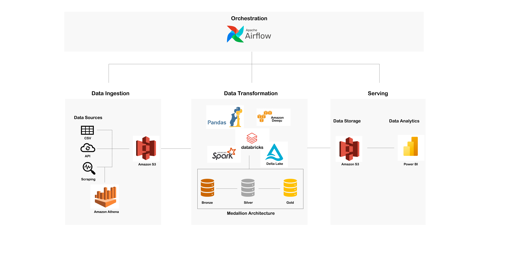
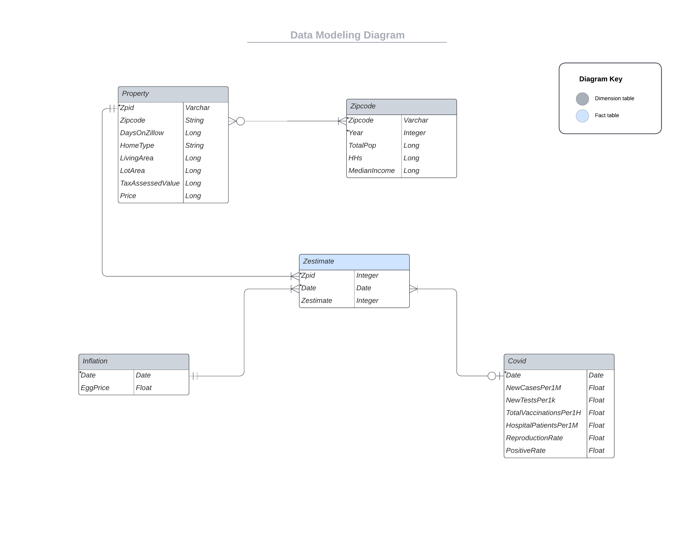
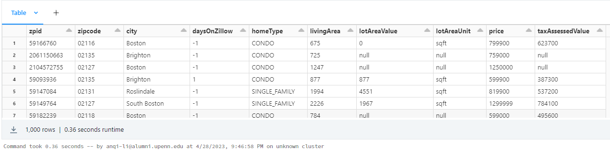
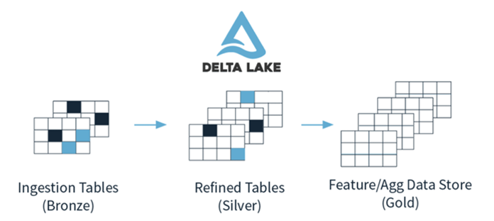
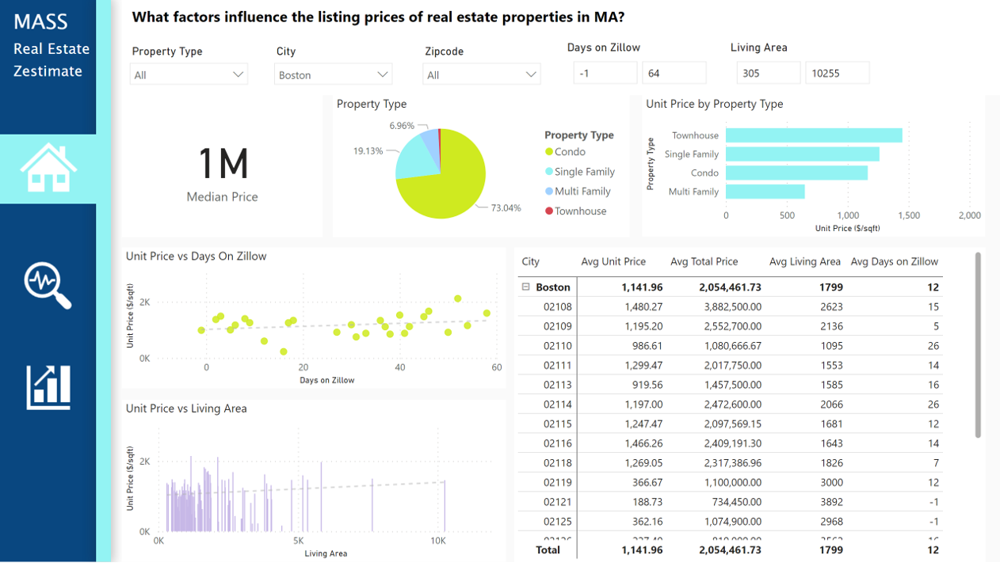
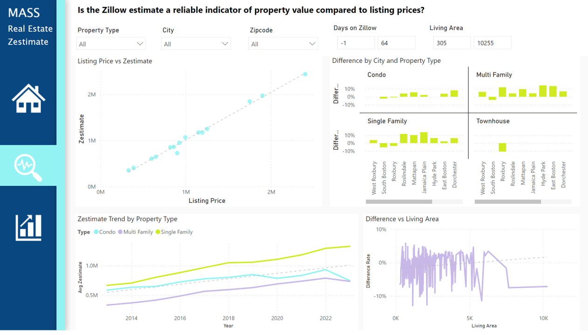
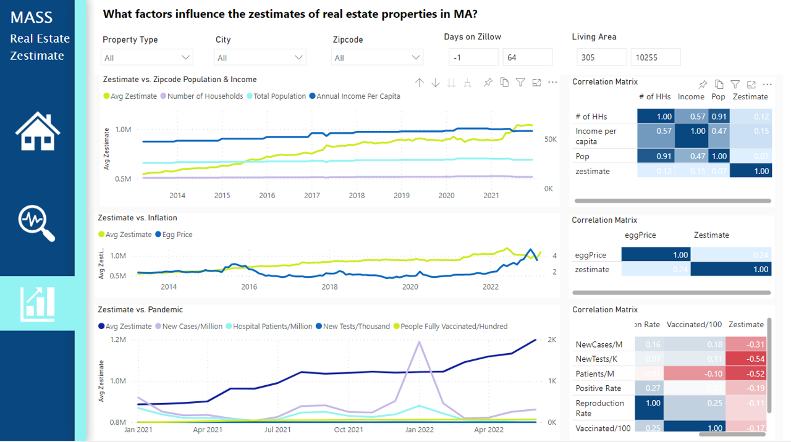

# Real Estate Property Price Analysis
## What this project does:
This is a data engineer project which focuses on exploring the relationship between real estate property prices and various property characteristics, as well as external factors. The primary objective is to gain insights into the factors influencing property prices and assess the accuracy of Zillow zestimates compared to actual listing prices. Additionally, the project examines the impact of factors such as inflation, Covid conditions, demographic data, and socio-economic conditions of the property's respective zipcode area.

## How this project works:
This project follows a data processing pipeline that involves data collection, processing, and visualization. A high-level summary of the architecture is shown in the diagram below.

First, relevant data is collected and compiled from various sources. This data is then stored in an **AWS S3 bucket** as **delta tables**, ensuring efficient storage and retrieval.

Next, the **Medallion Architecture** is applied to process and transform the collected data. Using **PySpark** in the **Databricks** platform, the data is structured into **bronze, silver, and gold** tables. This process involves cleaning, filtering, and aggregating the data to derive meaningful insights.

The processed data is stored back in the AWS S3 bucket, maintaining the **Delta table** format for enhanced data integrity and performance.

In the serving layer, **Power BI** is utilized to visualize the analytic findings, enabling the creation of insightful visualizations and reports.

To ensure smooth execution and monitoring of the project, **Airflow** is employed for orchestrating and scheduling the data processing pipeline. Airflow handles the automation of job workflows, allowing for efficient job execution and management.

### Data Sources
In this project, the data collection process was carefully designed to gather the necessary metrics for analysis. The **data model** was first created (as shown in the diagram below), identifying the key metrics and their relationships.

To collect the required data, multiple sources were utilized. 

- The property listing price and historical zestimates were obtained from Zillow. Python functions were developed to fetch the data from the **Zillow API**, ensuring accurate and up-to-date information.
- COVID data was sourced from a **MySQL JDBC database**. This data provides insights into the impact of the pandemic on the real estate market.
- Demographic and socio-economic data for each zip code area was sourced from the US Census as **CSV files**.
- Inflation data, an important external factor, was scraped from the internet using CommonCrawl and queried using **AWS Athena**. The chosen metric for inflation analysis was the price of eggs, obtained from Walmart.com. 

### Data Ingestion & Storage 
The data ingestion process involved loading the diverse raw data into the Databricks platform using PySpark. Each data source was ingested and saved as **Delta tables** in an AWS S3 storage bucket. Delta tables provide reliability, scalability, and performance optimizations for big data workloads. In this way, the project ensured the data was readily available for subsequent processing and analysis

### Data Transformation 
The data transformation phase of the project implemented the Medallion Architecture to process and transform the collected data. PySpark, a powerful **distributed processing framework**, was utilized within the Databricks platform to perform these transformations efficiently.

To ensure data quality, the project utilized the **Amazon Deequ** library, which performed data quality checks on the bronze table and provided valuable suggestions for data constraints and improvements.
The collected data was structured into bronze, silver, and gold tables, leveraging PySpark's capabilities for **data cleaning, filtering, and aggregation** to derive meaningful insights from the data.

### Performance Tunning 
In this project, the following significant steps were taken to enhance the performance and efficiency of the data processing pipeline.

First, **partitioning** strategies were implemented, which helps optimize resource allocation by allowing data to be distributed across multiple nodes or computing resources. This **parallel processing** capability enhances scalability and resource utilization in distributed computing environments, ensuring efficient utilization of storage and computing resources.

Besides, partitioning enables efficient data retrieval and query execution by dividing data into smaller, more manageable subsets. When executing queries, the system can skip irrelevant partitions, resulting in faster query response times.

Additionally, **caching** mechanisms were utilized to store intermediate results and frequently accessed data in memory, reducing the need for repetitive computations and improving response times.

Moreover, the power of **adaptive query execution** enabled dynamic optimization of query plans based on runtime statistics and conditions. It allows the query optimizer to adapt and make decisions during query execution, considering factors such as data distribution, skewness, join selectivity, and available resources.

### Data Visualization 
In the data visualization phase of the project, **Power BI** was employed to create interactive dashboards that effectively conveyed the analytical results with the **gold tables** as the input source.

Power BI was seamlessly connected with Databricks, and queries were sent to Databricks, where **Spark** performed **distributed computations** to process the data. 

The **interactive** nature of the Power BI dashboards empowered users to delve into the data and gain valuable insights effortlessly. With just a few clicks, users could dynamically explore the impact of different variables on the listing price and zestimates, enabling them to make informed decisions based on the visualized analytics.

